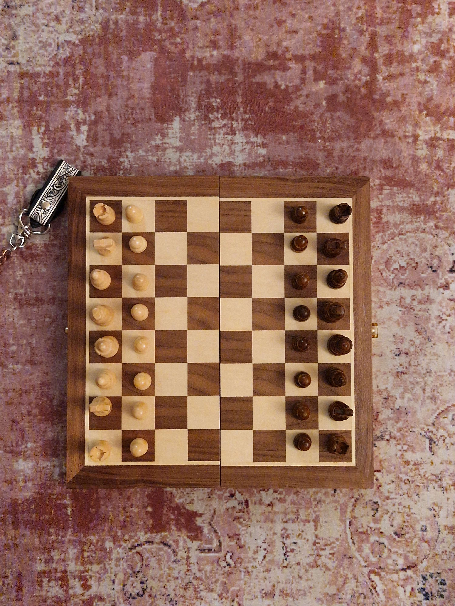
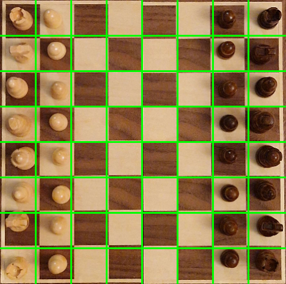

# ♟️ Machine Vision Chessboard

A Python-based machine vision application that detects a physical chessboard in **real-time** using OpenCV and processes moves from a live camera feed with the [`python-chess`](https://github.com/niklasf/python-chess) library.

This system is designed to automate board recognition and move tracking for casual games, tournaments, or chess analysis — eliminating the need for manual input and time management software.

---

## 📸 Example Screenshots

<table>
<tr>
<td><br><b>Original Board View</b></td>
<td><br><b>Warped & Aligned View</b></td>
</tr>
</table>

---

## 🚀 Features

- Real-time board detection from webcam
- Perspective correction and grid extraction
- Tracks piece positions and move changes
- Integrates with `python-chess` for legal move validation
- Easy to extend for PGN/FEN export, clock management, or online play

---

## 🧰 Requirements

- Python 3.x
- OpenCV
- numpy
- python-chess
- matplotlib *(optional, for visualization)*

### 🔧 Installation

```bash
pip install opencv-python numpy matplotlib python-chess
